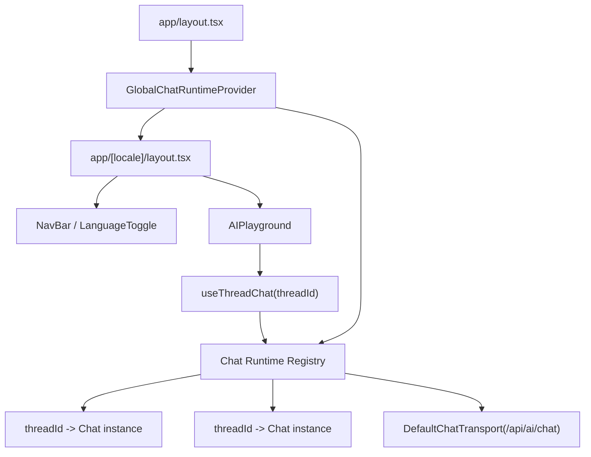

# AI Lab Global Persistent Chat Runtime Plan

## 背景

当前 AI Lab 的聊天页位于 `[locale]` 路由下面：

- `app/[locale]/ai/page.tsx`
- `app/[locale]/ai/AIPlayground.tsx`

语言切换通过 `next-intl` 的 locale routing 完成：

- `app/components/navbar/LanguageToggle.tsx`

切换语言时会触发：

- `router.replace(pathname, { locale })`

这会导致 `[locale]` subtree 重新挂载。  
而当前 AI 聊天运行时 (`useChat`) 直接定义在 `AIPlayground.tsx` 内部，所以组件卸载时：

- 当前 `Chat` 实例被销毁
- 正在 streaming 的回复被中断
- 只有在 `onFinish` 后才会落到线程状态，因此中间态消息会丢失

这就是“AI thinking 时切换语言，chatbox 像重新渲染，消息直接消失”的根因。

---

## 目标

实现一个**跨 locale 页面重挂载依然存活**的全局聊天运行时，使 AI Lab 在以下情况下都能尽量保持连续：

1. 切换中英文时，不丢失当前线程消息
2. AI 正在回复时，页面 UI 可以重挂载，但底层 chat runtime 不销毁
3. 同一个 thread 在不同组件层中复用同一个 `Chat` 实例
4. 后续可平滑接入：
   - 持久化
   - resume stream
   - 工具调用
   - generative UI

---

## 结论

最佳方案不是只改 `useChat` 的 `messages` 初始化，也不是单纯禁用语言切换。

最佳方案是：

**把 `Chat` 实例提升到 `[locale]` 之外，由一个全局 Provider / Registry 按 `threadId` 持有并复用。**

核心思想：

- UI 可以被重建
- `Chat` 实例不能跟着一起重建
- `AIPlayground` 不再“创建 chat”，而是“订阅一个已有 chat”

---

## 为什么选这个方案

### 相比“流式中持续写 localStorage”

优点：

- 不只是“保住已经显示出来的文字”
- 而是真正让同一个流继续活着
- 不依赖频繁写本地存储
- 后续更适合做工具调用和中间态展示

缺点：

- 实现复杂度更高

### 相比“AI thinking 时禁用语言切换”

优点：

- 用户体验更自然
- 不需要回避问题
- 可以保留语言切换能力

缺点：

- 需要引入一层全局状态管理

### 相比“直接上 AI SDK resume streams”

官方 `resume` 更偏向：

- 页面刷新
- 网络断连重连
- 需要配套持久化 active stream 和 resume endpoint

而你当前的问题首先是：

- locale 切换导致的组件卸载

所以第一步更适合先做：

- **全局 Chat Registry**

后续如果你还要支持硬刷新后继续恢复，再叠加 `resume`。

---

## 目标架构



设计要点：

1. `GlobalChatRuntimeProvider` 放在 `app/layout.tsx` 下，必须在 `[locale]` 外层
2. Provider 内维护一个 `Map<threadId, Chat>`
3. `AIPlayground` 根据 `activeThreadId` 获取或创建对应 `Chat`
4. `useChat` 使用 `chat` 参数，而不是每次重新 new transport config
5. `LanguageToggle` 可以读取“是否存在任一 streaming chat”，作为 UX 控制依据

---

## 需要新增的模块

### 1. 全局 Chat Runtime Provider

建议新增：

- `app/context/GlobalChatRuntimeContext.tsx`

职责：

- 提供 registry 生命周期
- 提供以下接口：
  - `getOrCreateChat(threadId, initialMessages?)`
  - `removeChat(threadId)`
  - `getChat(threadId)`
  - `isAnyChatBusy()`
  - `isThreadBusy(threadId)`

内部状态建议：

- `Map<string, Chat<UIMessage>>`
- `Map<string, ChatRuntimeMeta>`

其中 `ChatRuntimeMeta` 可包含：

- `threadId`
- `status`
- `updatedAt`
- `lastPersistedAt`

### 2. Chat Registry Hook

建议新增：

- `app/hooks/useThreadChat.ts`

职责：

- 给 `AIPlayground` 一个稳定 API
- 根据 `threadId` 拿到全局 `Chat` 实例
- 包装 thread 切换、初始消息注入、busy 判断

期望接口：

```ts
const {
  chat,
  status,
  isBusy,
  messages,
  sendMessage,
  stop,
} = useThreadChat({
  threadId,
  initialMessages,
  onMessagesPersist,
})
```

### 3. Streaming UI Coordination Hook

建议新增：

- `app/hooks/useChatRuntimeStatus.ts`

职责：

- 给 navbar 或 language toggle 暴露运行态
- 避免非 AI 页面也去感知复杂 chat 细节

返回值建议：

- `hasBusyChat`
- `busyThreadIds`
- `activeThreadBusy`

---

## 需要修改的现有模块

### 1. `app/layout.tsx`

当前：

- 只是最外层 `<html><body>{children}</body></html>`

需要改为：

- 把 `GlobalChatRuntimeProvider` 放进 `body` 内

推荐结构：

```tsx
<body>
  <GlobalChatRuntimeProvider>
    {children}
  </GlobalChatRuntimeProvider>
</body>
```

原因：

- 切换 locale 时 `[locale]` subtree 会重建
- 但 `app/layout.tsx` 不会因为 locale 改变而卸载
- 所以这里最适合挂全局 runtime

### 2. `app/[locale]/ai/AIPlayground.tsx`

当前问题：

- `ChatThreadView` 内部直接 `useChat({ messages, transport, onFinish })`
- runtime 生命周期跟组件绑定

需要改为：

- `ChatThreadView` 不再直接创建 chat
- 改用 `useThreadChat(thread.id, thread.messages)`
- `useChat({ chat })`

推荐思路：

```tsx
const chat = useThreadChatRuntime(thread.id, thread.messages)
const { messages, sendMessage, status } = useChat({ chat: chat.instance })
```

这样 `ChatThreadView` 卸载时：

- `useChat` 订阅关系消失
- 但 `chat.instance` 还在 provider 里活着

### 3. `app/hooks/useChatThreads.ts`

当前职责：

- 管理线程列表
- 本地存储 thread messages

需要调整的点：

- `messages` 不再被视为 chat 的唯一真实来源
- 它应该变成“持久化快照”

建议：

1. thread 仍然保存 `messages`
2. 但这些消息只作为：
   - 首次创建 runtime 的初始值
   - 页面恢复后的 fallback
3. 每个全局 `Chat` 需要把最新消息持续回写到 thread store

也就是说：

- `useChatThreads` = persistence layer
- `Global Chat Registry` = live runtime layer

### 4. `app/components/navbar/LanguageToggle.tsx`

当前：

- 无条件切 locale

后续建议支持两种策略：

#### 策略 A：默认允许切换

- 因为 runtime 已全局持久化，所以大多数情况下可以继续

#### 策略 B：软保护

如果 `hasBusyChat === true`：

- 仍允许切换，但增加轻提示
- 或在极端情况下禁用按钮

推荐先做 A，再保留 B 的开关位。

---

## 关键实现设计

### 1. Chat 实例的身份键

必须统一用 `threadId` 作为 registry key。

原因：

- thread 是用户视角的会话单元
- locale 切换前后 `threadId` 不变
- 这才能把同一段流绑定到同一 runtime

不要使用：

- locale
- pathname
- useChat 自动生成 id

否则会在切换语言时产生新实例。

### 2. 首次创建 vs 复用实例

`getOrCreateChat(threadId, initialMessages)` 的逻辑建议：

1. 如果 registry 里已有实例：
   - 直接返回已有实例
2. 如果没有：
   - 用 `new Chat(...)` 创建实例
   - 传入：
     - `id: threadId`
     - `messages: initialMessages`
     - `transport: new DefaultChatTransport(...)`
     - `onFinish`
     - `onError`
     - `onData`（如需要）
   - 存入 registry

注意：

- 同一 `threadId` 的 transport 配置要稳定
- 不要在每次 render 时重新构造一套会导致实例替换的配置

### 3. 持续持久化消息

即使做了全局 runtime，也仍然建议持续持久化：

- 用于刷新恢复
- 用于后续 resume stream
- 用于线程列表展示

但这里不需要每个 token 都立刻写 `localStorage`。

建议：

- 对 `chat.messages` 的变化做节流持久化
- `200ms - 500ms` 足够

持久化时机：

1. `messages` 更新时节流同步
2. `status` 从 `streaming -> ready` 时强制落一次
3. `beforeunload` 可选补一次

### 4. 清理策略

Provider 需要考虑 chat 实例不能无限增长。

建议规则：

- 删除 thread 时同步 `removeChat(threadId)`
- 页面会话内最多保留最近 `N` 个 chat runtime
- 对长时间未访问且非 busy 的 runtime 执行回收

推荐第一版：

- 先只做“删除 thread 时回收”
- 不做自动 GC

这样更简单可靠。

### 5. busy 状态判断

`Chat` 自身有 `status`：

- `ready`
- `submitted`
- `streaming`
- `error`

Provider 里可以订阅并镜像出：

- `isBusy = status === "submitted" || status === "streaming"`

用途：

- 控制语言切换按钮
- 控制线程切换时是否提示
- 控制新建聊天时是否允许打断旧流

---

## 分阶段实施计划

### Phase 1: 抽离 Runtime 层

目标：

- 不改现有 UI 外观
- 只把 `Chat` 生命周期从 `AIPlayground` 中抽出来

工作：

1. 新增 `GlobalChatRuntimeProvider`
2. 新增 `useThreadChat`
3. 在 `app/layout.tsx` 挂 provider
4. 把 `AIPlayground.tsx` 改成使用 `chat` 参数版 `useChat`

验收：

- 普通聊天流程不回归
- thread 切换正常

### Phase 2: 流式状态持续持久化

目标：

- 即使组件重新挂载，也能拿到接近实时的消息快照

工作：

1. 为每个 runtime 接入节流持久化
2. 调整 `useChatThreads` 的职责边界
3. 保证 thread snapshot 与 runtime messages 一致

验收：

- streaming 中手动切 locale，不会清空已显示内容

### Phase 3: 语言切换优化

目标：

- 切换语言时对 busy chat 的 UX 更柔和

工作：

1. `LanguageToggle` 读取全局 busy 状态
2. 决定是：
   - 允许切换并保活
   - 或切换时给出提示
3. 可选加入“AI 正在回复中”提示

验收：

- 切换语言时不再出现明显“整段消失”

### Phase 4: 为 resume streams 预留接口

目标：

- 后续如果要支持页面刷新 / 硬断线恢复，能继续往前接

工作：

1. 给 thread snapshot 补充 `activeStream` 元信息
2. 统一 `threadId` 作为 chat id
3. 后续再接：
   - `resume: true`
   - `prepareReconnectToStreamRequest`
   - `/api/chat/[id]/stream`

注意：

- 这一步不是当前必须做

---

## 文件级改造清单

### 新增

- `app/context/GlobalChatRuntimeContext.tsx`
- `app/hooks/useThreadChat.ts`
- `app/hooks/useChatRuntimeStatus.ts`
- 可选：`app/lib/ai/chat-runtime-registry.ts`

### 修改

- `app/layout.tsx`
- `app/[locale]/ai/AIPlayground.tsx`
- `app/hooks/useChatThreads.ts`
- `app/components/navbar/LanguageToggle.tsx`

### 暂不需要改

- `app/api/ai/chat/route.ts`

原因：

- 当前 bug 的主因在 client runtime 生命周期
- 服务端接口暂时可以保持不变

---

## 伪代码草图

### Provider

```tsx
type RuntimeEntry = {
  chat: Chat<UIMessage>
  status: ChatStatus
  updatedAt: number
}

const registry = new Map<string, RuntimeEntry>()

function getOrCreateChat(threadId: string, initialMessages: UIMessage[]) {
  const existing = registry.get(threadId)
  if (existing) return existing.chat

  const chat = new Chat({
    id: threadId,
    messages: initialMessages,
    transport: new DefaultChatTransport({
      api: "/api/ai/chat",
    }),
    onFinish: ({ messages }) => persist(threadId, messages),
    onError: (error) => markError(threadId, error),
  })

  registry.set(threadId, {
    chat,
    status: "ready",
    updatedAt: Date.now(),
  })

  return chat
}
```

### AI Playground

```tsx
const chat = useThreadChat({
  threadId: activeThread.id,
  initialMessages: activeThread.messages,
})

const { messages, sendMessage, status } = useChat({
  chat: chat.instance,
})
```

### Language Toggle

```tsx
const { hasBusyChat } = useChatRuntimeStatus()

<NavTextButton
  disabled={hasBusyChat && disableDuringStreaming}
  onClick={...}
/>
```

---

## 风险与注意事项

### 1. Chat 实例与 React 生命周期脱钩后，更容易产生“陈旧订阅”问题

解决方式：

- 所有 callback 都由 provider 统一创建
- UI 层不要在实例内部塞入频繁变化的闭包

### 2. thread 删除时必须同步回收 runtime

否则：

- localStorage 里线程删了
- registry 里实例还活着

会造成状态幽灵。

### 3. locale 切换后文案会更新，但历史消息不会自动翻译

这是预期行为，不是 bug。  
新的 UI 文案会切换语言，但旧消息内容仍保持生成时的语言。

### 4. 如果将来接 `resume: true`

要注意官方文档中提到的约束：

- resume streams 和 abort 行为不完全兼容
- 需要额外的 active stream persistence

所以不要把“全局 runtime”与“resume streams”混成一步做。

---

## 推荐实施顺序

如果开始真正开发，我建议按这个顺序落：

1. Provider + Registry 搭起来
2. `AIPlayground` 切到 `useChat({ chat })`
3. 持续持久化消息快照
4. 验证 locale 切换中 streaming 是否仍保留内容
5. 再决定 `LanguageToggle` 要不要保留软禁用策略

---

## 成功标准

完成后，以下行为应成立：

1. 用户发送 prompt 后，AI 开始 streaming
2. 在回复未完成时切换中英文
3. 页面 UI 可以重建
4. 当前 thread 的聊天内容不丢失
5. 若请求本身未被中断，stream 继续推进
6. 若请求因路由切换中断，也至少保留已生成部分，不出现整段清空

---

## 我对这个方案的建议

这套方案值得做，原因是它不只是修一个 locale bug，而是在给 AI Lab 补一层真正的 runtime 基础设施。

它会顺手解决或改善这些后续问题：

- 线程切换时的状态一致性
- 后续消息持久化
- 未来接 resume streams
- 后续引入 tool calls / generative UI 时的稳定性

如果要控制成本，可以分两次提交：

1. 第一次只做全局 runtime 与 locale 切换保活
2. 第二次再做流式持久化和 toggle UX 优化

---

## 参考资料

实现时建议以这些官方文档为准：

- `useChat` reference: [https://ai-sdk.dev/docs/reference/ai-sdk-ui/use-chat](https://ai-sdk.dev/docs/reference/ai-sdk-ui/use-chat)
- Chatbot Message Persistence: [https://ai-sdk.dev/docs/ai-sdk-ui/chatbot-message-persistence](https://ai-sdk.dev/docs/ai-sdk-ui/chatbot-message-persistence)
- Chatbot Resume Streams: [https://ai-sdk.dev/docs/ai-sdk-ui/chatbot-resume-streams](https://ai-sdk.dev/docs/ai-sdk-ui/chatbot-resume-streams)
- `createAgentUIStreamResponse`: [https://ai-sdk.dev/docs/reference/ai-sdk-core/create-agent-ui-stream-response](https://ai-sdk.dev/docs/reference/ai-sdk-core/create-agent-ui-stream-response)
